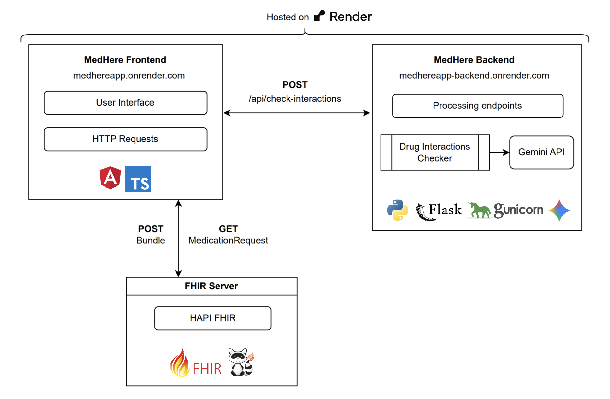

# MedHere

**MedHere** is a comprehensive medication management application designed to help users stay on top of their health. 

## Team

Developed by **Team Capybaras** for CS6440 IHI (Introduction to Health Informatics).

## Features

- **Dashboard** - View today's medications, upcoming doses, and reminders at a glance. Mark medications as taken and track missed doses.
- **Medication List** - Add, edit, and delete medications with detailed information (dosage, frequency, start/end dates, notes).
- **Calendar View** - Visualize medication schedules via day, week, or month views.
- **Drug Interaction Checking** - AI-powered analysis of potential drug interactions using Google Gemini.
- **FHIR Integration** -  Integration with the public HAPI FHIR server for standardized healthcare data exchange.

## Architecture

Below is the architecture diagram of the application:



### Architecture Overview

**Frontend (Angular + TypeScript)**
- Built with Angular framework and TypeScript
- Deployed on Render (https://medhereapp.onrender.com/)
- Provides user interface for all application features

**Backend (Python + Flask + Gunicorn + Gemini)**
- Python Flask application served by Gunicorn
- Deployed on Render (https://medhereapp-backend.onrender.com/)
- Handles drug interaction checking by integrating with Google Gemini API
- Endpoint: `/api/check-interactions`

**HAPI FHIR Server**
- Public FHIR server which stores and provides medication data in standardized FHIR format
- Frontend uploads medication bundles and retrieves medication data

## Project Structure
Below is a tree of the most important directories and files for this project.

```
cs6440-fall25-group55/
├── frontend/                   # Angular application
│   ├── src/
│   │   ├── app/                # Application components
│   │   ├── assets/             # Static assets
│   │   └── environments/       # Environment configurations
│   └── README.md               # Frontend setup instructions
├── backend/                    # Flask API
│   ├── backend.py              # Main Flask application
│   ├── wsgi.py                 # WSGI entry point
│   ├── interaction_checker.py  # Drug interaction checking logic
│   ├── requirements.txt        # Python dependencies
│   ├── Procfile                # Render deployment config
│   └── README.md               # Backend setup instructions
└──  dataset_samples/           # Sample FHIR data files
```

## Quick Start for Development

### Prerequisites

- **Node.js** (v16 or higher) and npm
- **Python** 3.8 or higher
- **Angular CLI**: `npm install -g @angular/cli`
- **Google Gemini API Key** (for interaction checking)

### Frontend Setup

```bash
cd frontend
npm install
ng serve
```

The frontend should be available at `http://localhost:4200`

See [frontend/README.md](frontend/README.md) for detailed instructions.

### Backend Setup

```bash
cd backend
pip install -r requirements.txt

# Set up environment variable
# Create .env file with: GEMINI_API_KEY=api_key_here
echo "GEMINI_API_KEY=api_key_here" > .env

python backend.py
```

The backend should run at `http://127.0.0.1:5001`

See [backend/README.md](backend/README.md) for detailed instructions.

## Deployment

The application is deployed on Render.com:

- **Frontend**: Angular application served as static site
- **Backend**: Flask application running with Gunicorn deployed as a web service